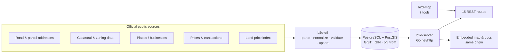
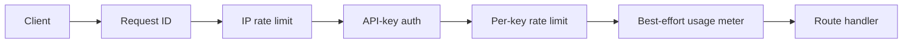

# b2d_geo_public

**A curated public engineering case study of a production-deployed Korean geospatial data platform: deterministic public-data ETL, PostGIS, a Go REST API, and a seven-tool MCP adapter.**

[](https://github.com/JO-HEEJIN/b2d_geo_public/actions/workflows/ci.yml)
[](go.mod)
[](docker-compose.yml)
[](migrations/001_init.sql)
[](https://api.birth2death.com/)

[Live map](https://api.birth2death.com/map.html) · [Interactive API docs](https://api.birth2death.com/docs.html) · [Health](https://api.birth2death.com/v1/health) · [OpenAPI 3.1](openapi.yaml)

> **The data was public. The infrastructure wasn't.**

Korea publishes rich address, parcel, zoning, land-price, and transaction datasets, but turning them into one low-latency query path requires format-specific ingestion, normalization, provenance, spatial indexing, authentication, and operational discipline. b2d-geo builds that missing infrastructure without depending on a commercial geocoding provider.

This is a curated public engineering snapshot. It contains representative production code, tests, schemas, and design decisions—not raw government datasets, credentials, internal prompts, full experiment logs, business records, or proprietary processing methods.

## At a glance

| Surface | What is implemented |
| --- | --- |
| Serving scale | Documented full-load snapshot: **39,728,087** cadastral parcels (2026-08-01), **222,379,474** parcel–zoning rows (2026-07-30), and **596,986** standard lots |
| REST | **15 `/v1` route templates** for health, usage, geocoding, reverse geocoding, places, parcels, and land/appraisal facts |
| Agent interface | **7 MCP tools** over local stdio or stateless HTTP |
| Data pipeline | **10 domain loaders** plus migration, API-key, and index-backfill commands |
| Runtime | Go `net/http`, PostgreSQL 16, PostGIS 3.4, `pgx/v5`, GiST, GIN, and `pg_trgm` |
| Dependency posture | **4 direct third-party Go modules** |
| Delivery | One distroless, non-root image containing the API, ETL CLI, MCP adapter, migrations, and embedded web UI |

The counts above are dated operational records, not a promise about the current live database and not data included in this repository.

## System architecture



The serving path is deliberately deterministic: it returns source facts and transparent calculations, not model-generated estimates. The separate [bridge-damage detection case study](docs/bridge-damage-detection.md) demonstrates applied-ML evaluation work; it is **not** part of this geospatial serving path.

### Request lifecycle



Request IDs wrap the complete `/v1` chain, so rejected authentication and rate-limit responses remain traceable. Metering is intentionally non-blocking: it protects request latency, with the explicit trade-off that a full buffer or failed flush can lose usage events. See [architecture](docs/architecture.md).

## What you can query

| Area | Routes |
| --- | --- |
| Geocoding | `GET /v1/geocode`, `POST /v1/geocode/batch`, `GET /v1/reverse` |
| Places | `GET /v1/places/search` with keyword, initial-consonant, category, and radius modes |
| Parcels | `GET /v1/parcel/{pnu}`, `/by-point`, `/by-jibun` |
| Land facts | official price, standard lots, land use/zoning, land features, price index, and transaction routes under `/v1/appraisal/*` |
| Operations | `GET /v1/health`, `GET /v1/usage` |

Five land/appraisal routes query the local data layer. The transaction route calls the official MOLIT API when `MOLIT_API_KEY` is configured. The OpenAPI file documents exact parameters and response shapes.

## Try the live system

The [map demo](https://api.birth2death.com/map.html) runs against real public-data records. The [interactive docs](https://api.birth2death.com/docs.html) can use an operator-configured, rate-limited demo key.

```bash
export B2D_API_KEY="<issued demo key>"

curl --get 'https://api.birth2death.com/v1/geocode' \
  --header "Authorization: Bearer ${B2D_API_KEY}" \
  --data-urlencode 'q=서울특별시 중구 세종대로 110'
```

Every `/v1` response includes `X-Request-Id`; failed requests can be correlated with server logs using that value.

## MCP in 60 seconds

The adapter exposes:

`geocode` · `reverse_geocode` · `search_places` · `get_parcel` · `get_land_value` · `get_transactions` · `get_zoning`

For the hosted HTTP mode:

```json
{
  "mcpServers": {
    "b2d-geo": {
      "url": "https://api.birth2death.com/mcp",
      "headers": {
        "Authorization": "Bearer <issued API key>"
      }
    }
  }
}
```

Claude Code CLI:

```bash
claude mcp add --transport http b2d-geo \
  https://api.birth2death.com/mcp \
  --header 'Authorization: Bearer <issued API key>'
```

The implementation is a focused tools adapter supporting `initialize`, `ping`, `tools/list`, and `tools/call`; it does not claim the full MCP surface. Local line-delimited stdio mode is also available. See [cmd/b2d-mcp](cmd/b2d-mcp).

## Production engineering evidence

| Decision | Evidence | Why it matters |
| --- | --- | --- |
| Request ID outside auth and limits | [server.go](internal/api/server.go), [reqid.go](internal/api/reqid.go) | Errors before the handler are still traceable |
| IP limit → auth → key limit → meter | [server.go](internal/api/server.go) | Unauthenticated floods are bounded before DB-backed auth; authenticated quotas are isolated |
| HTTP drain before meter drain | [main.go](cmd/b2d-server/main.go), [meter.go](internal/meter/meter.go) | In-flight handlers finish before their final usage events are flushed |
| Optional Sentry integration | [main.go](cmd/b2d-server/main.go), [sentry.go](internal/api/sentry.go) | Missing or failed observability setup does not stop the service |
| Explicit secret scrubbing | [sentry.go](internal/api/sentry.go), [tests](internal/api/sentry_test.go) | Request/user payloads are removed; known secret values are replaced in messages, exceptions, and breadcrumbs |
| Same-binary UI and REST API | [web/embed.go](web/embed.go), [server.go](internal/api/server.go) | The bundled frontend shares an origin with the API and needs no separate CORS configuration |
| Schema-level provenance | [001_init.sql](migrations/001_init.sql), [007_appraisal.sql](migrations/007_appraisal.sql), [011_land_use_plan.sql](migrations/011_land_use_plan.sql) | Primary serving datasets require `source` and `source_version` at write time |
| Small dependency surface | [go.mod](go.mod) | The module declares four direct third-party dependencies |
| CI quality checks | [ci.yml](.github/workflows/ci.yml) | Main pushes and pull requests run `go vet`, `go test`, `govulncheck`, and `staticcheck` |

More context, including rejected alternatives, is in [engineering decisions](docs/engineering-decisions.md). A sanitized real debugging example is in [failure analysis](docs/failure-analysis.md).

A [proposed temporal-data publication architecture](docs/design/temporal-data-publication.md) explores historical queries, source-driven ETL scheduling, immutable releases, blue-green/canary data publication, and caching with rate limiting. It is explicitly a **design proposal**, not a claim that those future capabilities are implemented.

## Data pipeline and provenance

`b2d-etl` provides implemented paths for road-address buildings, places, entrance points, cadastral parcels, land transactions, land-price indices, standard lots, parcel zoning, individual official prices, and land features. Migrations are embedded in the binary and applied transactionally.

Primary serving tables enforce both `source` and `source_version`. Here, `source_version` is lineage metadata, but its meaning is loader-specific: it may identify an upstream publication date or the ingestion date. The repository does not flatten those semantics into a stronger universal claim.

Raw data is intentionally absent. Source terms, attribution requirements, and redistribution limits must be checked before loading or publishing a derived database. See [data specifications](docs/dataspec).

## Run locally

Prerequisites: Go 1.26.4+ (toolchain pinned to 1.26.5), Docker, and Docker Compose.

```bash
make up
make migrate
make build
make test
```

This creates the schema and binaries, but an empty database cannot geocode. Load only source datasets whose terms you have reviewed:

```bash
./bin/b2d-etl apikey create \
  --name local-review \
  --scopes geo,realestate \
  --rate 10

./bin/b2d-server
```

The API key command prints the plaintext once and stores only its SHA-256 hash. Override the local database connection with `B2D_DATABASE_URL`.

## Repository map

```text
cmd/b2d-server/   REST server, lifecycle, optional observability
cmd/b2d-etl/      migrations, data loaders, API-key administration
cmd/b2d-mcp/      seven-tool MCP adapter (stdio + HTTP)
internal/         address, auth, geocode, meter, parcel, places, ETL
migrations/       PostGIS schema and serving indexes
web/              embedded map, batch client, and API docs
docs/             architecture, decisions, sanitized case studies
openapi.yaml      OpenAPI 3.1 contract
```

## Known limitations

- Raw and licensed datasets are not distributed, so a clone starts with an empty database.
- Snapshot counts are dated operational records rather than CI-recomputed or live-count guarantees.
- Historical date/release selection is a [design proposal](docs/design/temporal-data-publication.md), not a currently supported API contract or a guarantee of nationwide historical coverage.
- Individual official prices and land features were loaded Seoul/Gyeonggi-first; an unloaded region returns `REGION_NOT_LOADED` rather than a guessed value.
- Usage metering favors availability and latency over lossless billing semantics.
- DB-backed route integration coverage is an area for further work; the included unit suite concentrates on parsing, auth, request IDs, metering, provenance-sensitive loaders, and Sentry scrubbing.
- The embedded demo key, when configured, is intentionally browser-visible and must be low-scope and aggressively rate-limited by the operator.

## Public/private boundary

This repository demonstrates publicly reviewable architecture and representative implementation. It intentionally excludes credentials, raw/licensed datasets, production infrastructure identifiers, customer or business records, internal prompts, full learning logs, model checkpoints, detailed experiment recipes, and proprietary data-processing methods.

That boundary is part of the engineering story: public claims here are limited to what the code and dated records can support.

## License and security

This is source-available portfolio material, not an open-source release. No reuse license is granted; see [LICENSE](LICENSE). Please report suspected vulnerabilities privately as described in [SECURITY.md](SECURITY.md).
