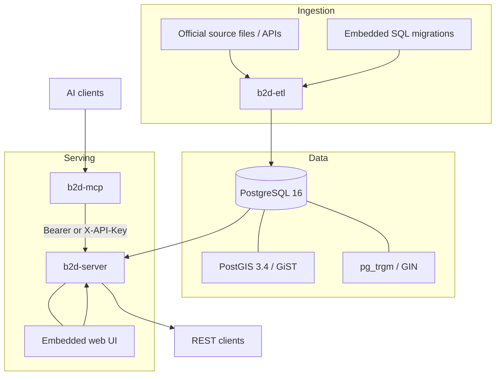
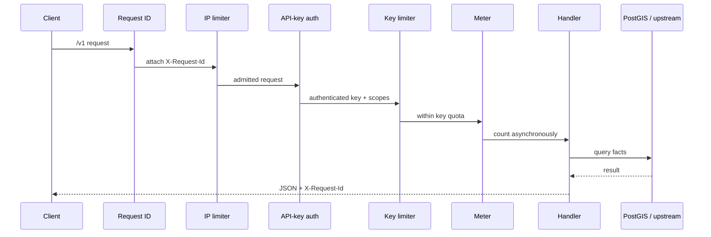
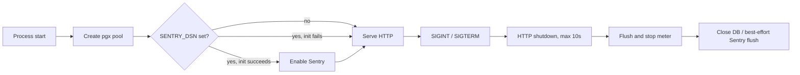
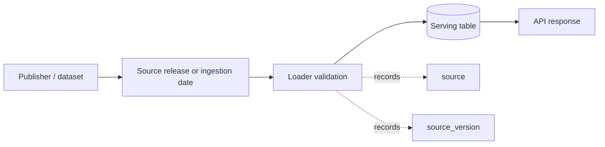

# Architecture

This document describes the public serving architecture represented by this repository. Production credentials, host identifiers, and raw data are intentionally omitted.

## Components

### `b2d-etl`

The CLI owns schema migration, source-specific parsing, validation, and bulk loading. Its implemented data paths cover:

- road-address buildings;
- business/place records and Korean initial-consonant backfill;
- building entrance points;
- cadastral parcel shapefiles;
- land transactions;
- land-price indices;
- standard-lot prices;
- parcel-level zoning;
- individual official prices; and
- land features.

The loaders are source-specific because their formats and version semantics differ. A generic abstraction would hide meaningful ingestion contracts.

### PostgreSQL and PostGIS

PostgreSQL is the integration boundary between ingestion and serving. The schema uses:

- PostGIS geometry and GiST indexes for containment, distance, and nearest-neighbor work;
- `pg_trgm` and GIN indexes for Korean place/address text search;
- primary and composite indexes for PNU and regional lookups; and
- `source` plus `source_version` constraints on primary serving datasets.

Migrations are compiled into the ETL binary with `go:embed`, so a release artifact carries the schema version it expects.

### `b2d-server`

The server uses Go's standard `net/http` router. Its route families are:

- geocode, batch geocode, and reverse geocode;
- keyword/nearby place search;
- parcel lookup by PNU, point, or legal-dong/jibun; and
- official price, standard lots, zoning, land features, price index, and transaction facts.

The embedded website and REST API share one handler and one origin. That removes a separate frontend deployment and avoids CORS configuration for the bundled client.

### `b2d-mcp`

The MCP executable is a thin adapter over the HTTP API. It exposes seven high-level tools and supports local line-delimited stdio JSON-RPC plus stateless HTTP POST mode. It is intentionally tools-focused rather than a claim of full MCP feature coverage.

## Request lifecycle

`GET /v1/health` is explicitly exempted from authentication and rate limiting. Other `/v1` routes pass through the full chain. Security headers wrap both static and API responses.

The meter uses a bounded channel and batch flushes. If the channel is full, it drops an event instead of blocking the request. This is suitable for best-effort product telemetry, not lossless financial accounting.

## Startup and shutdown

Observability is compiled in but operationally optional: an absent DSN or initialization error does not prevent service startup. The Sentry hook removes request and user payloads, then replaces known secret values in messages, exceptions, and breadcrumbs.

## Data lineage

`source_version` is intentionally interpreted per loader. Some sources publish a dated release; other API ingestions record the load date. Consumers should not assume one universal meaning.

## Trust boundaries

- Raw and licensed data remains outside Git.
- Production secrets enter through environment variables.
- API keys are stored as SHA-256 hashes; plaintext is displayed only at creation time.
- The browser demo key is intentionally public when enabled and must be treated as a low-privilege, tightly rate-limited credential.
- The transaction route crosses an upstream boundary to the official MOLIT API; the remaining five land/appraisal routes query local data.
- Internal runbooks, infrastructure identifiers, customer data, and proprietary methods are outside this public snapshot.

