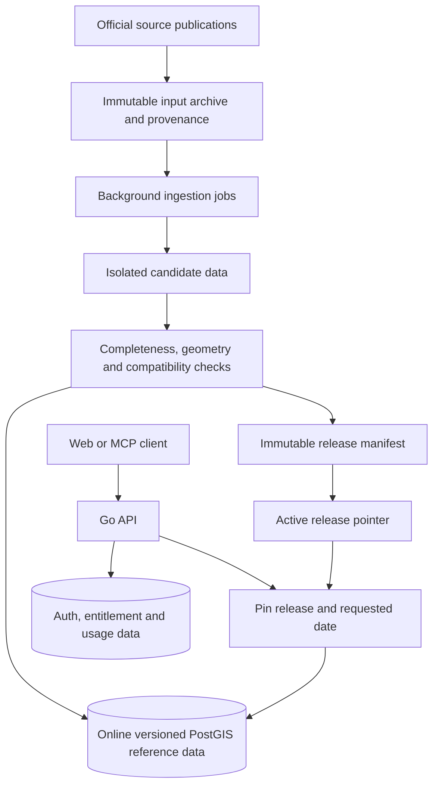
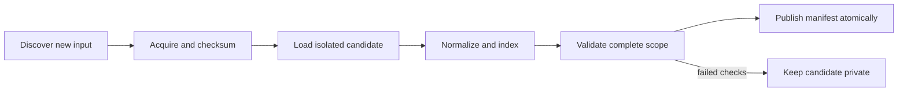
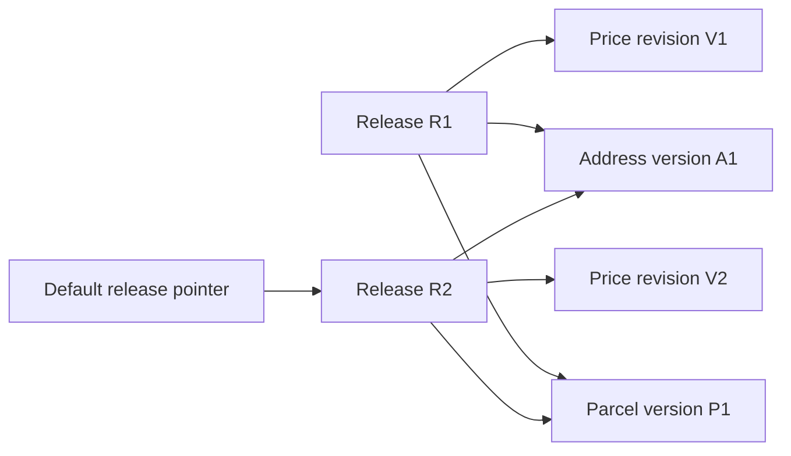
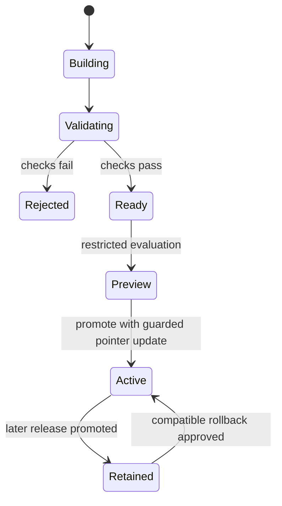
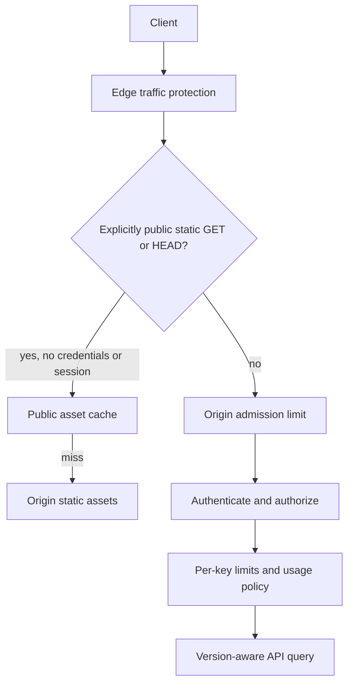

# Proposed temporal data and publication architecture

Status: **design proposal, not an implemented historical-query feature or a production SLA**. Updated 2026-09-12.

This document extends the [current architecture](../architecture.md) with a possible path to historical geospatial queries, controlled data publication, and edge protection. All release identifiers, time parameters, and coverage interfaces below are proposed contracts. The existing [OpenAPI contract](../../openapi.yaml) remains the description of implemented endpoints.

The public version intentionally omits deployment identifiers, credentials, internal operating procedures, raw datasets, and proprietary processing details. It explains architectural decisions, not a production runbook.

## 1. Start with the product promise

The target requirement is: **query parcel boundaries and associated facts for a supported past date without running ingestion or restoring an archive during the request**.

That promise has important boundaries:

- Only publish historical coverage supported by acquired, validated source material. A timestamp on today's geometry cannot reconstruct yesterday's parcel.
- Historical parcel and attribute layers are not historical aerial imagery or a historical commercial basemap. If a current basemap is displayed, label the difference.
- An annual assessed value is not a daily market price. Report the source's reference date and meaning.
- A source observation is not automatically proof of the exact day a real-world change took effect.
- A supported historical query must remain possible on a cache miss. Compressed offline archives alone cannot satisfy this requirement.

Begin with a bounded pilot: one region, multiple genuine source vintages, and a correction case. Expand the advertised coverage only after correctness and capacity checks.

## 2. Separate the clocks

| Concept | Meaning | Why it matters |
| --- | --- | --- |
| Source reference time | Date or interval the source describes | Defines the meaning of a fact |
| Source publication time | When the provider released it | Distinguishes delayed releases and corrections |
| Collection time | When the platform acquired it | Supports reproducibility and ingestion diagnostics |
| Platform publication time | When a validated release became queryable | Defines what platform users could have seen |

Two historical questions are different:

1. **What do the best available records now say about date D?** Use a requested reference date with the newest compatible correction release.
2. **What could the platform have answered at publication time T?** Pin the immutable release that was available then.

A proposed `as_of` parameter selects the date being described; a `release_id` selects the version of platform knowledge. Neither substitutes for the other. If the upstream data only supports periodic observations, the response must identify that time basis instead of claiming exact effective-date history.

For example, a later correction to an annual assessed value creates a new release. The corrected historical query can use it, while a query pinned to the earlier release remains reproducible. This is a proposed capability, not evidence that every past correction has been collected.

## 3. Target architecture

The **reference-data plane** contains parcels, addresses, prices, and their retained versions. The **operational-data plane** contains keys, entitlements, and usage. A reference-data rollback must not revert customer access or erase usage records.

Start with logical separation through roles and schemas where appropriate; physical separation is a capacity and isolation decision, not an automatic prerequisite. Run expensive ingestion away from request handlers and give it explicit resource budgets. A separate schema on the same machine is not CPU or I/O isolation.

The runtime connects to the online serving PostGIS data, not to a raw archive or a staging database. On physical separation, authentication uses the operational store and spatial queries use the serving store. Optional read replicas must prove the selected release is present before receiving its traffic; replication lag cannot silently select another version.

## 4. Scheduling follows source changes

Discovery, collection, validation, and publication have different cadences. Checking for a release does not mean rebuilding unchanged data.

| Dataset class | Proposed scheduling policy | Candidate update strategy |
| --- | --- | --- |
| Addresses, parcels, zoning | Check the provider's release mechanism at a reasonable daily or weekly cadence; ingest only new or corrected editions | Source-scoped snapshot or validated change set |
| Businesses and places | Follow the source publication cycle; preserve the reference date | Replace a complete source scope, or merge a documented delta |
| Assessed values and annual land attributes | Main run on the applicable annual release, plus correction discovery | Retain year/reference-date versions and subsequent revisions |
| Transactions | Periodic incremental collection with an overlapping reconciliation window | Deduplicate and reconcile late reports, cancellations, and corrections |
| Published price indices | Follow the actual publication calendar and revised editions | Retain period and revision metadata |

These are design policies, **not claims about every provider's current publishing frequency or configured production jobs**. Confirm each feed's official cadence, pagination, quotas, terms, and correction mechanism before setting a schedule. Choose reconciliation windows from observed delay patterns and perform less frequent deeper reconciliations where necessary.

Measure each job's input size, wall time, peak memory, database connections, write volume, and index-build cost. Bound concurrency by the tightest shared resource, including provider quotas. HTTP load balancing does not schedule ETL tasks or increase database write capacity.

A timer plus a durable run ledger can be sufficient initially. Airflow becomes useful when dependencies, selective retries, backfills, and operator visibility justify its operational footprint. It should orchestrate existing ingestion programs rather than force a rewrite of domain logic. See the [Airflow architecture overview](https://airflow.apache.org/docs/apache-airflow/stable/core-concepts/overview.html).

## 5. Asynchronous work, ordered dependencies, atomic publication

- **Asynchronous to the user request:** ingestion and backfills run in the background. A normal read never waits for them.
- **Dependency ordered inside a job:** validation cannot pass before its inputs and indexes are complete. Independent datasets may run concurrently within a shared budget.
- **Atomic at publication:** readers observe one coherent release selection, not a mixture produced by a long-running update.

Calling this “semi-synchronous” would obscure the decisions. Database semi-synchronous replication is a different topic; it is not required by this batch-publication design.

Use a durable run identity based on source, scope, input version, and transformation version. Retries should be idempotent: repeating the same successful input must not duplicate facts. Checkpoint independent work units, record failure states, prevent overlapping publications for the same scope, and distinguish retryable transport failures from invalid data.

## 6. Merge only when the source supports it

**Full snapshot:** load the entire declared scope into a candidate. Compare counts and key sets, build indexes, and publish only after completeness checks. A missing record can imply deletion only when the input is an authoritative complete snapshot for that scope.

**Incremental change set:** use stable identities, ordering/version metadata, and documented deletions. Reconcile gaps and duplicate deliveries. An empty response, incomplete page sequence, or failed region download is not permission to delete existing data.

**Revised facts:** retain a new immutable revision rather than overwriting a released version. Cancelled transactions need source-supported cancellation handling; simply appending every fetched row can double-count them.

Parcel splits and merges require lineage where the source supports it. An identifier or geometry changing over time is not safely handled by joining all historical prices to the current parcel shape. Never infer a precise parcel match from intentionally masked transaction locations.

## 7. Releases compose independently changing datasets

A **release manifest** is an immutable record of the exact dataset versions, coverage, schema compatibility, and validation evidence offered together. An **active pointer** is the small mutable record selecting the default manifest.

Changing the price dataset should not require copying an unchanged national geometry dataset. Reuse immutable versions through the manifest, but validate compatibility across datasets and temporal scopes. A manifest containing “the latest of everything” is not automatically a coherent historical release.

For a request, resolve the manifest once and carry that selection through all reads. A single pointer lookup followed by mutable “current” tables would not provide the same guarantee. Multi-statement reads may need an appropriate transaction snapshot as well as explicit version filtering; PostgreSQL's default Read Committed isolation does not give all statements one fixed snapshot. See [PostgreSQL transaction isolation](https://www.postgresql.org/docs/16/transaction-iso.html).

For a map session, return a validated release selection that subsequent tiles and detail requests can reuse. Otherwise, independent requests can straddle a deployment and display mixed layers. Cursors, exports, and MCP calls should carry the same context where they form one logical result.

## 8. A/B data publication and canary validation

Keep the old version serving while the candidate is built. Promote a fully validated manifest with a short transaction and an expected-current-release check so concurrent publishers cannot overwrite one another's decision.

This resembles **blue-green deployment**, applied to reference-data selection. It is not necessarily two entire database servers and must not be interpreted as permission to recycle all historical storage into two slots.

A **canary** exposes a compatible candidate to a limited, stable cohort before wider adoption. Pin the cohort's release across related requests; do not randomly switch each tile independently. Candidate access is authorization-controlled, and its cache entries cannot be reused for users who may only see the published release.

Use preview and comparison checks before customer-facing canaries when correctness differences are difficult for users to interpret. Compare geometry validity, expected fact changes, latency, query failures, and representative multi-layer results—not only HTTP error rate.

Rollback changes the reference-data pointer. It does not undo auth or billing state. Retain the earlier version and confirm that running code can still read it. In-flight requests may finish on their pinned version; all-or-nothing publication does not mean every client switches at the same instant. Record who promoted or rolled back which manifest and why.

## 9. Caching and rate limiting have separate jobs

Caching reuses results to reduce repeated work. Rate limiting bounds admitted traffic. A cache hit still consumes edge processing and network capacity, so a high hit ratio is not a substitute for traffic protection.

The initial proposal is **Cloudflare for explicitly public static assets and edge protection; Go for authenticated API policy; PostGIS and background workers for data work**. No application response cache is required merely to adopt this division. This document does not assert that Cloudflare rules have been deployed.

Start with an allowlist of real static paths. Bypass API, MCP, key issuance, configuration responses, credentials, and session-bearing requests. An API path ending in an image or script extension must not become public merely because of that suffix. Configure and test the actual provider rule order so cached traffic is protected too.

Honor private/no-store policies and avoid accidental storage of personalized responses. Cloudflare's default behavior does not automatically cache HTML or JSON; custom rules can change the policy. See [Cloudflare default cache behavior](https://developers.cloudflare.com/cache/concepts/default-cache-behavior/).

Do not turn on shared caching for a metered API until every hit still enforces authentication, entitlement, revocation, quota, and the intended usage-accounting contract. Define a single accounting owner to avoid missed or double-counted usage. A telemetry tool is not a billing ledger.

If API result caching is later justified, a conceptual key must distinguish:

`API contract + release + reference date + time basis + normalized parameters + authorized data scope`

The server must validate those dimensions before lookup. Include all response-affecting filters; never place raw credentials in public keys or logs. Different releases, corrected facts, tenants, and restricted candidates must not collide. Unversioned “latest” selection needs its own bounded freshness policy.

Keep origin protection even with an edge layer. Trust forwarded client addresses only from verified proxy peers, and account for the whole proxy chain. Per-process or per-location rate limits are not exact global monthly quotas; Cloudflare explicitly describes its Worker binding's location-local, permissive counting behavior in the [rate limiting documentation](https://developers.cloudflare.com/workers/runtime-apis/bindings/rate-limit/). Measure normal map-loading bursts and shared-network behavior before choosing thresholds. Application limits alone are not complete DDoS protection.

## 10. Retention is a product and capacity decision

Keep all advertised historical coverage online and indexed. The archive preserves acquired inputs and reproducibility; it is not the live query path. Define separate policies for active releases, older supported releases, failed candidates, source archives, and operational records.

Estimate capacity from representative measurements of geometry, attributes, indexes, retained revisions, staging overlap, database logs, and backups. Include temporary space for building a candidate while the previous release still serves traffic. A second schema on one disk and a pointer rollback are neither a backup nor high availability.

Share unchanged dataset versions before considering more complex row-level temporal storage. Partitioning, compression, incremental geometry history, separate worker hosts, and replicas are later options with explicit performance and maintenance trade-offs. Garbage collection must honor references from active/retained manifests, in-flight requests, and promised reproducibility windows. Announce coverage retirement; do not silently move supported history offline.

## 11. Acceptance checks before offering historical queries

| Gate | Evidence required |
| --- | --- |
| Source truth | Actual historical material; distinct reference, publication, and collection times |
| Complete ingestion | All expected scopes/pages present; repeated execution does not duplicate facts |
| Spatial integrity | Geometry, coordinate system, identities, lineage, and representative cross-layer joins checked |
| Coverage truth | Unsupported dates/regions return an explicit coverage result, never today's data as a silent fallback |
| Release consistency | Related reads remain pinned while publication occurs; corrections preserve earlier releases |
| Safe promotion | Failed candidates stay private; concurrent publishers cannot silently overwrite each other |
| Safe rollback | Reference data reverts coherently while auth and usage remain intact |
| Cache isolation | Cache miss works online; versions, credentials, scopes, and preview data do not leak across requests |
| Capacity | Cold-cache reads and ingestion coexist within measured latency, memory, disk, and connection budgets |
| Recovery | Restore and rollback procedures are exercised independently |

Observe API errors and latency alongside ingestion run status, source freshness, validation results, release identity, cache behavior, and resource pressure. Correlate requests and jobs with non-secret identifiers. A successful HTTP health check cannot establish data completeness.

## 12. Implementation sequence and open decisions

1. Inventory historical inputs, licensing, date semantics, and intended coverage. Record unsupported periods explicitly.
2. Add durable run metadata, idempotency, isolated candidates, and completeness gates to a pilot dataset.
3. Introduce immutable versions, manifests, compatible request pinning, guarded publication, and rollback tests.
4. Add online historical geometry and associated fact queries for the pilot; measure cache-miss performance and storage cost.
5. Implement consistent date/release propagation in web and MCP clients, coverage feedback, and correction semantics.
6. Extend datasets and regions only after the gates pass. Add orchestration complexity when the run graph and operations require it.
7. Introduce separately approved edge rules with cache isolation and rate-limit tests; evaluate protected API caching only with a complete authorization and accounting design.

Still to decide: exact historical coverage, source-supported effective-date semantics, retention windows, public API contract, measured performance targets, job concurrency budgets, and whether distributed quotas or lossless usage accounting are product requirements. None is implied by the diagrams.

## Glossary

| Term | Meaning in this proposal |
| --- | --- |
| ETL | Extract source data, transform it, and load queryable records |
| Staging / candidate | Non-public data being built and checked |
| Idempotency | Repeating the same work does not create extra or inconsistent results |
| Immutable version | Released data that is not edited in place |
| Manifest | Exact, validated combination of dataset versions and coverage |
| Atomic publication | A release-selection change that is observed as a complete decision |
| Request pinning | Keeping the same validated data version throughout related work |
| Blue-green | Preparing a complete alternative before switching the default selection |
| Canary | Limited, observable exposure before wider promotion |
| Cache hit / miss | Reusing a stored result / computing or fetching it from the origin |
| Rate limit | A bounded admission policy over a defined subject and time scope |
| Coverage | The dates, regions, datasets, and time semantics the service can actually support |
