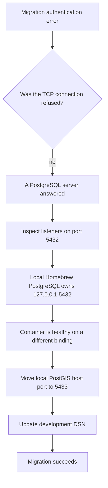

# Failure analysis: the healthy container that was not receiving connections

This is a sanitized account of a real local-development failure. Hostnames, credentials, and unrelated services are omitted.

## Symptom

The PostGIS container reported healthy, but the migration command failed with:

```text
role b2d does not exist
```

The first instinct—"the container is broken"—did not fit the evidence. A connection refusal would indicate no listener. An authentication error meant a PostgreSQL server had accepted the connection and answered.

## Investigation



`lsof` showed that an existing local PostgreSQL instance, not the container, held the more specific loopback binding. The client was reaching that database, which correctly reported that its own role set did not contain `b2d`.

## Resolution

The existing database was not stopped. The container's host port moved to `5433`, and the development DSN was updated accordingly.

## Prevention

- The local Compose file now maps PostGIS to host port `5433`.
- Development defaults consistently point to that port.
- Diagnosis begins by classifying the failure: connection, authentication, schema, or application.
- A "healthy container" is treated as evidence about the container, not proof that a client reached it.

## Why this example matters

The useful skill was not memorizing a Docker command. It was preserving the distinction between hypotheses:

1. reproduce the exact error;
2. infer what must already be working;
3. inspect the host-level listener;
4. isolate the conflicting service;
5. fix the binding without disrupting unrelated work; and
6. encode the new invariant in configuration.

